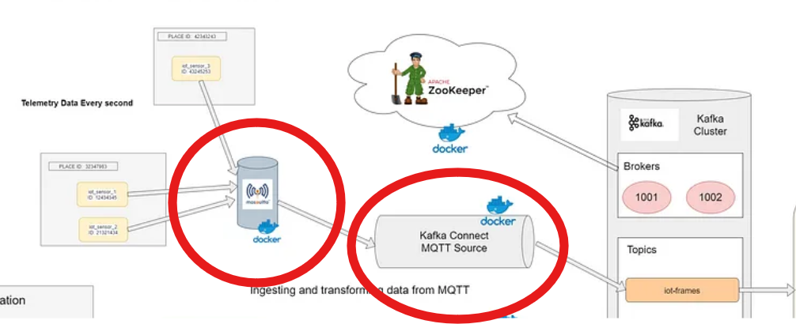
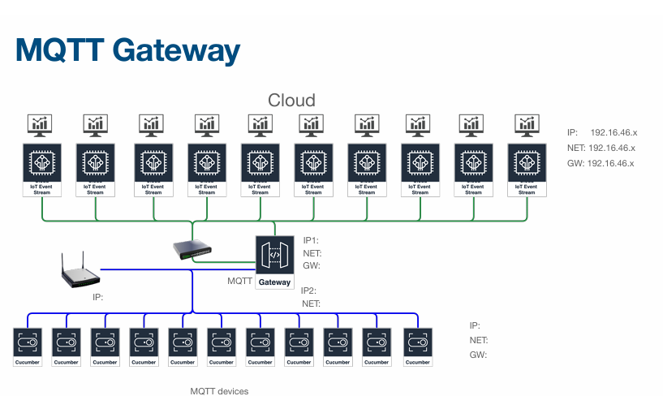

# MQTT
(Message Queuing Telemetry Transport)
เป็นส่วนที่สื่อสารและส่งข้อมูลระหว่างอุปกรณ์ IoT และ service ต่างๆภายในการทำงาน ใช้การสื่อสารแบบ Publisher-Subscriber
ในที่นี้ MQTT อยู่ในกระบวนการที่ส่งข้อมูลไยังkafka connect และ kafka connect ก็จะรับข้อมูลเพื่อประมวลผลและส่งออกไปยังservice อื่นๆ 

- update
ตอนนี้ได้เปลี่ยนส่วนของ MQTT เป็น gateway หรือ ตัวกลาง สำหรับรับทุกข้อมูล sensor ทุกกลุ่ม ให้ gateway รับค่าข้อมูล sensor ทั่วทุกกลุ่มที่มีการตั่งค่า IP mqtt ของ kafka connect

